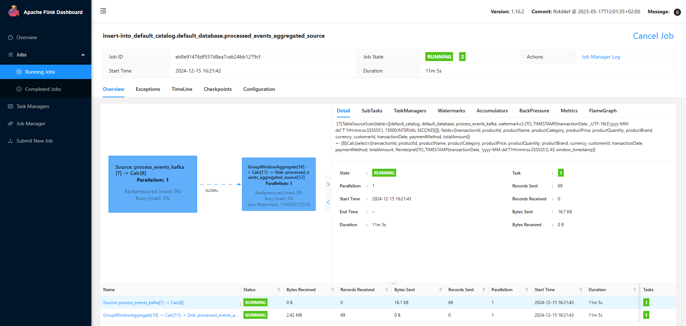

# Apache Flink E-Commerce Analytics with Elasticsearch and Postgres

This repository contains an Apache Flink application for real-time sales analytics built using Docker Compose to orchestrate the necessary infrastructure components, including Apache Flink, Elasticsearch, and Postgres. The application processes financial transaction data from Kafka, performs aggregations, and stores the results in both Postgres and Elasticsearch for further analysis.

## Requirements
- Docker
- Docker Compose

## Architecture

## Installation and Setup
1. Clone this repository.
2. Navigate to the repository directory.
3. Install `make` extension (or run directly command defined in Makefile)
3. Run `make up` to start the required services (Apache Flink, Elasticsearch, Postgres).
4. The Sales Transaction Generator `make produce_message` helps to generate the sales transactions into Kafka.
5. Start Transaction jon `make transaction_job` helps to ingest raw data from Kafka topic to Postgres and Elasticsearch.
5. Start Transaction jon `make aggregation_job` helps to ingest raw data from Kafka topic and then aggregate data and write to Postgres 

## Usage
1. Ensure all Docker containers are up and running.
2. Run the FlinkCommerce application provided in this repository to perform real-time analytics on financial transactions.

### Application Details
The `/src/python/transaction_job.py` class within the `/src/python/aggregated_job.py` package serves as the main entry point for the Flink application. The application consumes financial transaction data from Kafka, performs various transformations, and stores aggregated results in both Postgres and Elasticsearch.

### Components
#### Apache Flink
- Sets up the Flink execution environment.
- Connects to Kafka as a source for financial transaction data.
- Processes, transforms, and performs aggregations on transaction data streams.

#### Postgres
- Stores transaction data and aggregated results in tables (`transactions`, `order_by_product`, `order_by_window`).

#### Elasticsearch
- Stores transaction data for further analysis.

## Sink Operations
- The application includes sink operations for Postgres using JDBC to create tables (`transactions`, `order_by_product`, `order_by_window`) and perform insert/update operations.
- Additionally, it includes an Elasticsearch sink to index transaction data for further analysis.

